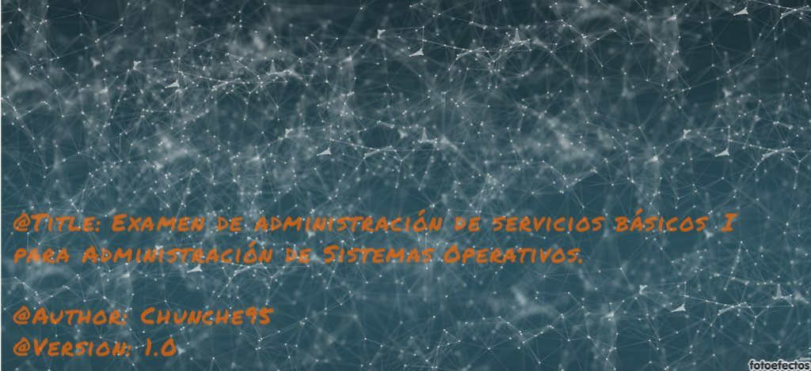

# ExamenesASO
<i>@Title:</i>
Pre-Examen  
<i>@Description:</i>
Preparación del examen de administración de servicios básicos I para Administración de Sistemas Operativos,
realizando menú de gestión.

<i>@Version:</i> 1.0  
<i>@Author:</i> <strong>Chunche</strong>

